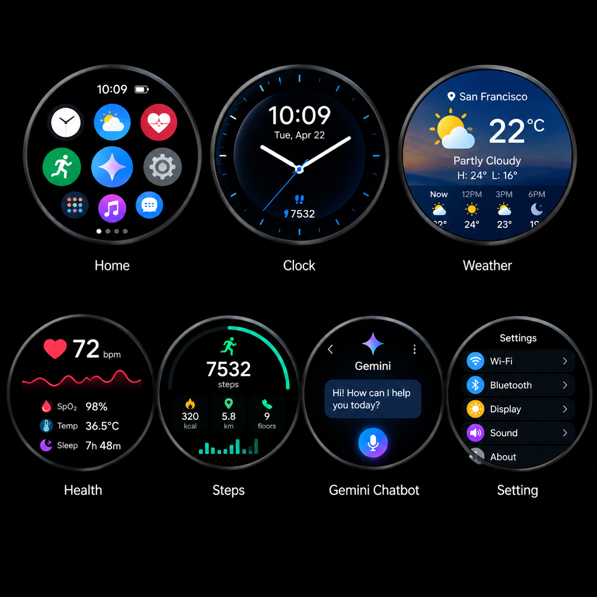
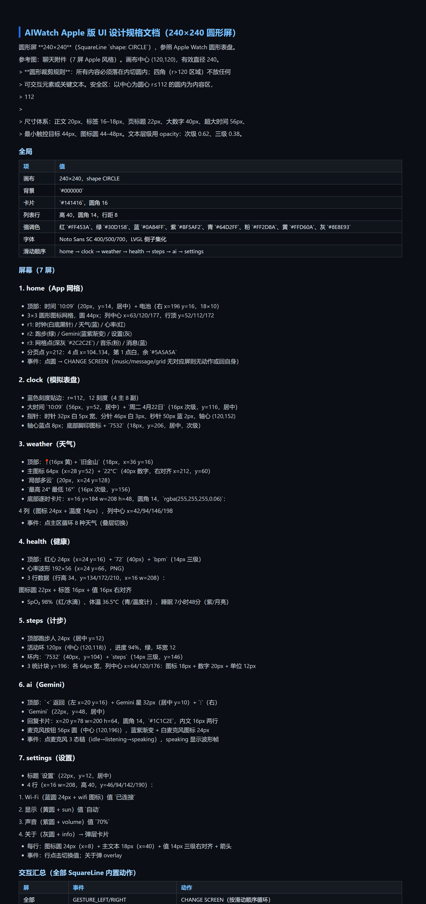
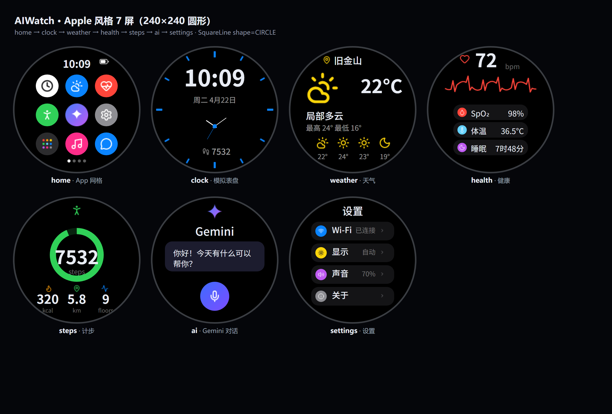
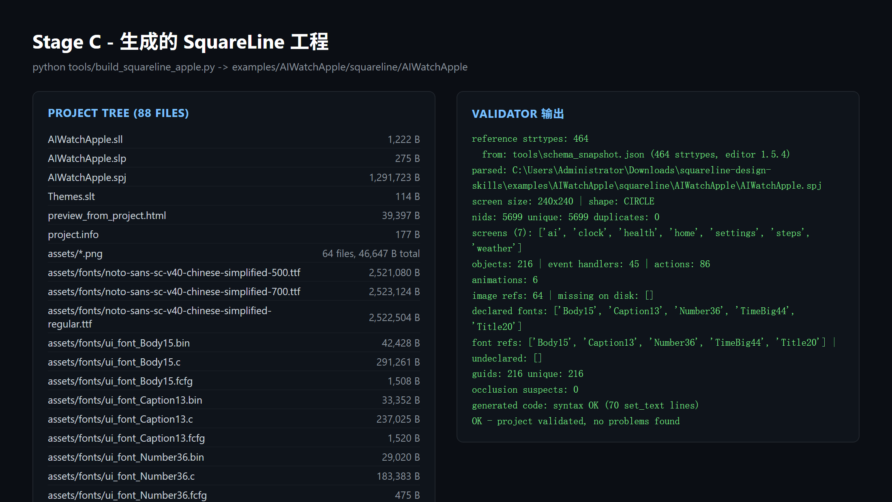
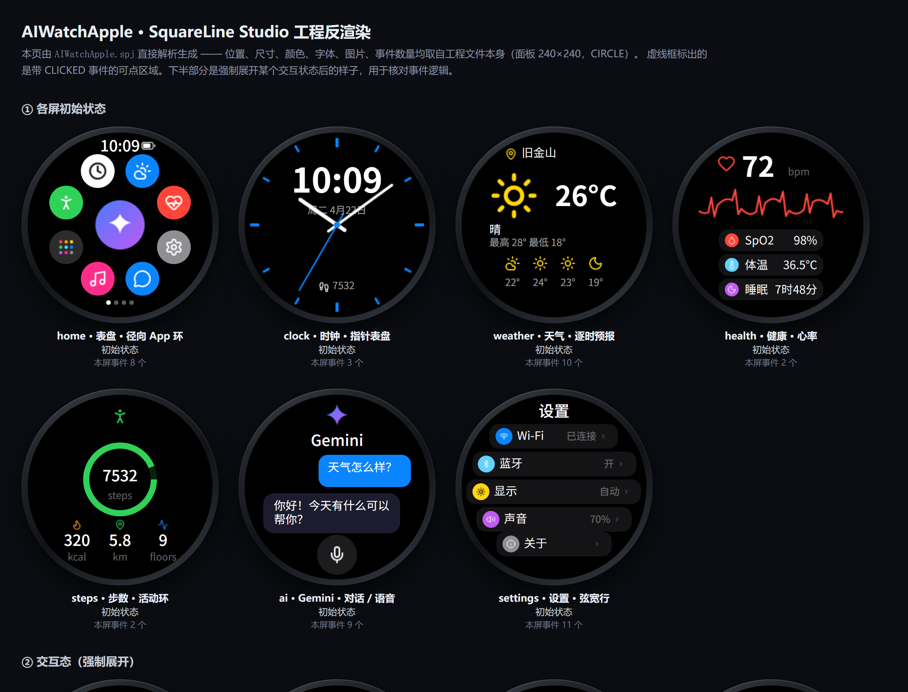

# squareline-design-skills

把一张 UI 参考图，变成一个**能用 SquareLine Studio 打开、且编辑器不报错**的完整 LVGL 工程。

这个包里没有绑定任何一家 agent 的代码，`skills/` + `tools/` 就是全部接口。
拷贝到任意位置，任何能读写文件、能跑命令的 agent 工具都能驱动它（各家 agent 的
**接入 agent 工具** 接法见 [接进你的 agent](#接进你的-agent)）。

---

## 使用方法

一分钟版：**把 `skills/` + `tools/` 拷到 agent 能读到的地方 → 给它参考图和需求 → 它按五个阶段走 →
每阶段跑校验 → 拿到的 `squareline/<Name>/<Name>.spj` 用 SquareLine Studio 打开。**

真要动手，按下面的顺序走就行。

### 1. 环境准备

| 需要 | 说明 |
|---|---|
| **Node.js** | 渲染 PNG、字体子集化、mockup 内联。依赖已内联在 `tools/node_modules`，**不用 npm install** |
| **Python 3** | 构建工程、校验、预览（本机 3.13 实测通过） |
| **SquareLine Studio** | **不需要**。校验器靠 `tools/schema_snapshot.json` 做 schema 对照；装了只是多一层交叉校验 |

### 2. 跑通第一个工程

仓库里已经有三个现成工程，**先拿它们跑通一遍最省事**，不需要准备参考图：

```bash
# 校验工程（应该打印 OK - project validated, no problems found）
python tools/validate_squareline_project.py examples/SpecWidget/squareline/SpecWidget

# 不开编辑器看效果（生成 preview_from_project.html，浏览器直接打开）
python tools/preview_from_project.py examples/SpecWidget/squareline/SpecWidget
```

这两条命令就是这个包的核心回环——**validator 管「工程有没有问题」，
反渲染管「长得对不对」**。后面做自己的工程，也是反复跑这两条。

想从零编译一个工程（`SpecWidget` 是最小示例，320×320、无位图资产）：

```bash
python tools/build_from_spec.py examples/SpecWidget/SpecWidget.spec.json \
       --out examples/SpecWidget/squareline/SpecWidget
```

跑完会打印工程信息，末尾无 `ERROR` 即为成功：

```
screens   : 2
objects   : 18
images    : 0  missing: []
fonts     : [('Big48', 48, 13), ('Title20', 20, 293), ('Body16', 16, 293)]
charset   : ui-text 46, doc-headroom 291 (+246 usable)
lineheight: {'Big48': 60, 'Title20': 23, 'Body16': 20}
OK - project validated, no problems found
```

### 3. 做自己的工程

流程分五个阶段，**每阶段都有独立校验，可以随时中断检查**。

| 阶段 | 干什么 | 产出 | 怎么算过 |
|---|---|---|---|
| **Stage 0**<br>写规格文档 | 复制 `templates/设计规格文档模板.md`，逐节填成 `<Name>设计规格文档.md` | 设计规格文档——**后续每个阶段都拿它当基准** | 三条人工检查：`rect` 全用屏幕绝对坐标；文案字符集写全；控件高 ≥ 字体行高 |
| **Stage A**<br>生成资产 | `node tools/generate_assets*.mjs` 把图标/自绘 SVG 渲成 PNG（2px ≈ 1dp） | `assets/images_*/` | 读 PNG 头核对真实尺寸；与 mockup 引用比对 missing / unused |
| **Stage B**<br>出 mockup | 出 `mockup.html`，`inline_mockup.mjs` 压成单文件 | `mockup.html` / `*_standalone.html` | 未缩放重叠审计 |
| **Stage C**<br>编译工程 | 常规屏走 spec JSON → `build_from_spec.py`；径向等定制几何 → `tools/screens/<name>.py` | `squareline/<Name>/` 完整工程 | `validate_squareline_project.py` + `preview_from_project.py` |

> **为什么一定要先写 Stage 0**：规格文档是唯一的「源真相」。引擎构建时会收录
> 文档里出现的每个字符进字体子集，所以**想改文案，必须先把新词写进文档**，
> 否则字体会缺字。这一步是人工确认点，文档没过就别往下跑。

最小可用的操作顺序：

```bash
# 1) 复制模板，填成你的设计规格（= source of truth）
cp templates/设计规格文档模板.md examples/<Name>/<Name>设计规格文档.md

# 2) 生成资产 + mockup
node tools/generate_assets_apple.mjs --out examples/<Name>/assets/images_apple
node tools/inline_mockup.mjs examples/<Name>/mockup.html examples/<Name>/mockup_standalone.html

# 3) 编译工程（常规屏走声明式规格，推荐）
python tools/build_from_spec.py  examples/<Name>/<Name>.spec.json --out examples/<Name>/squareline/<Name>
python tools/build_from_spec.py  --example     # 打印带注释的 spec 骨架

# 4) 验证 + 反渲染
python tools/validate_squareline_project.py examples/<Name>/squareline/<Name>
python tools/preview_from_project.py        examples/<Name>/squareline/<Name>
```

验收标准：validator 打印 `OK - project validated, no problems found`；
预览逐屏与 mockup 一致；SquareLine Studio 1.6.2 打开 `.spj` 无报错。

**到这儿就完了**——接下来用 SquareLine Studio 打开 `.spj` 开始用，
或者让 agent 继续加屏幕。

### 4. 交付物长什么样

```
examples/<Name>/
├── <Name>设计规格文档.md            # 源真相 —— 改需求先改这里
├── assets/images_*/                 # Stage A 产出的 PNG
├── mockup.html / *_standalone.html  # Stage B 的 HTML 预览
└── squareline/<Name>/               # Stage C 的 SquareLine 工程
    ├── <Name>.spj                   # ← 用 SquareLine「Open Project」打开这个
    ├── <Name>.sll / .slp / Themes.slt / project.info
    └── assets/                      # 图片 + 字体三件套（.c / .bin / .fcfg）
```

`backup/ cache/ components/ ui/` 是编辑器运行时产生的垃圾，不要提交。

---

## 全程走查：一张参考图 → 一个能打开的工程

上面的步骤说明完了。这一节用仓库里的 `examples/AIWatchApple`（240×240 圆形屏）
把每一步摊开，**全程截图**，你可以照着对一遍。

需求原文只有一句：**「这是手表首页的参考图，做一个 SquareLine 工程，240×240 圆形屏。」**

### ① 输入：参考图 + 一句话需求



参考图是 7 屏圆形表盘概念图，**尺寸、坐标、色值一律没给**——这些全部要由 Stage 0 反推。

### ② Stage 0：设计规格文档



产物 `examples/AIWatchApple/AIWatchApple设计规格文档.md`（91 行）。这一步定死了后面
所有阶段：画布 `240×240 / shape CIRCLE`、8 组强调色、7 屏逐屏的**屏幕绝对坐标**、
以及交互汇总表（全部只用 SquareLine 内置动作）。

圆形屏的约束写在文档头：内容区 `r≤112`，`112<r≤120` 只放贴边刻度。

### ③ Stage A：生成资产

```
node tools/generate_assets_apple.mjs --out examples/AIWatchApple/assets/images_apple
```

产出 **74 张 PNG**（图标、指针、心率波形 5 帧、Gemini 星、各态麦克风……），
统一 2px ≈ 1dp。渲染走 `tools/lib/resvg.mjs`（原生绑定优先，WASM 兜底），
所以 Linux 容器里不装东西也能跑。

### ④ Stage B：出 HTML mockup



`mockup_apple.html`（含 standalone 单文件版，图片已 base64 内联）。
7 屏圆形全部落在内切圆内。**布局对不齐就在这一步改，别等到工程里再改。**

### ⑤ Stage C：编译工程 + 校验

```
python tools/build_squareline_apple.py     # 定制几何（径向布局/指针对齐）
python tools/validate_squareline_project.py examples/AIWatchApple/squareline/AIWatchApple
python tools/preview_from_project.py        examples/AIWatchApple/squareline/AIWatchApple
```



左：生成的工程树（**88 个文件**，含 `.spj` 1.26MB、`.sll/.slp/Themes.slt/project.info`，
以及 `assets/` 里的 74 张 PNG + 5 套字体三件套）。右：validator 的真实输出：

| 校验项 | 结果 |
|---|---|
| `screen size / shape` | 240x240 / CIRCLE |
| `nids` | 5699 unique: 5699 duplicates: **0** |
| `screens` / `objects` | 7 / 216 |
| `event handlers` / `actions` | 45 / 86 |
| `occlusion suspects` | **0** |
| 结论 | **`OK - project validated, no problems found`** |

### ⑥ 反渲染：把生成的 `.spj` 再渲回图



`preview_from_project.py` 直接解析 `.spj` 反渲染（工程无关，尺寸/形状自动识别）。
把它和 ① 的参考图并排看，7 屏的几何与文案逐屏一致。

---

## 常见问题与踩坑

### asset 路径是扁平的

`assets_subdir` 只决定「从哪个源目录读素材」，**不会**写进工程引用。
工程里记录的引用**永远是** `assets/<文件名>`：

```jsonc
{
  "assets_subdir": "images",              // 只决定读哪个源素材包
  "screens": [{"children": [
    {"type": "IMAGE", "asset": "assets/img_logo.png"}   // ✅ 扁平路径
    //                "asset": "assets/images/img_logo.png"  ❌ 必错
  ]}]
}
```

写成 `assets/images/...` 会让工程指向一个它并不拥有的文件，于是每张图都报 `missing`。
`build_from_spec.py` 会在写 spec 的阶段就拦下来并告诉你正确写法。

### LABEL 高度必须 ≥ 字体行高

中文上下被裁切的根因：`line_height = max(ascent) + max(descent)`，**一定大于字号**。
按「高度 = 字号」留尺寸必然翻车。稳妥做法是留余量：

```
height >= ceil(size * 1.35)        # 单行中文的安全下界（实测比例 1.19~1.31）
```

**并且行高不是常量**——它取决于该工程收进了哪些字形，同一字体同一字号在不同工程里不同：

| 字体 | size | 字形数 | line_height | 工程 |
|---|---|---|---|---|
| `Body16` | 16 | 820 | **21** | `examples/AIWatch` |
| `Body16` | 16 | 293 | **20** | `examples/SpecWidget` |

想精确核对，跑一次构建看 `lineheight:` 那一行（列出本工程真实行高）。
速查表见 [`tools/LABEL_SIZING.md`](tools/LABEL_SIZING.md)（由 `label_sizing.py`
自动生成，`preflight.py` 校验它同步）；写代码生成 spec 时可以直接用
`tools/layout.py` 的 `label_sized()`，高度自动算。

### 布局算术不用手算

网格铺砖、卡片行、图标+文字这三类布局反复出现，手算 `rect` 是坐标漂移的来源。
`tools/layout.py` 提供纯函数（返回可直接塞进 `children[]` 的普通 dict）：

```python
from layout import grid, stack, card_row, icon_text, label_sized

tiles = grid((20, 60, 360, 220), cols=3, rows=2, gap_x=12, gap_y=12,
             factory=lambda x, y, w, h: panel("t", [x, y, w, h], radius=14))
card  = card_row("card_display", [24, 72, 272, 96], "显示", "自动", "Title20", "Body16")
lbl   = label_sized("hint", (30, 272), 260, "左滑进入设置", 16, "Body16")
```

`grid()` 在间距放不下时抛错而不是输出负宽度。自检：`python tools/layout.py`。

### 出问题先跑什么

```bash
python tools/validate_squareline_project.py <工程>   # 工程本身有没有问题
python tools/preview_from_project.py <工程>          # 不开编辑器看效果
```

这两条能定位绝大多数问题。只有改技能包本身才需要跑回归套件（见[自检](#自检改完包之后跑这个)）。

---

## 命令速查

```bash
# 构建
python tools/build_from_spec.py <spec.json> --out <dir>   # 声明式规格 → 工程（常规屏首选）
python tools/build_from_spec.py --example                 # 打印带注释的 spec 骨架
python tools/build_squareline_apple.py                    # 240×240 圆形（定制几何）
python tools/build_squareline_project.py                  # 410×502 方形（定制几何）

# 资产与 mockup
node tools/generate_assets_apple.mjs --out <dir>          # SVG → PNG
node tools/inline_mockup.mjs <in.html> <out.html>         # 压成单文件 standalone

# 验证与预览
python tools/validate_squareline_project.py <工程>
python tools/preview_from_project.py <工程>

# 自检（改技能包本身时才需要）
python tools/preflight.py                                 # 秒级体检
python tools/preflight.py --full                          # 追加回归套件
python tools/label_sizing.py                              # 刷新 LABEL 行高速查表
python tools/layout.py                                    # 排版库自检
```

---

## 接进你的 agent

这个包里**没有绑定某一家的代码**，区别只在「技能怎么被加载」这一层。
不管哪家，只要保证 agent 能读到 `skills/squareline-ui-pipeline/SKILL.md`，
并且 `tools/`、`fonts/`、`templates/` 同构存在即可——SKILL.md 里的命令
全是仓库相对路径，拷贝后零改动就能跑。

| Agent | 加载方式 | 配置要点 |
|---|---|---|
| **Freebuff / Codebuff** | `.codebuff/skills/` 自动发现 | 拷目录即可；模型选 `GLM-5.3-flash`（见 E） |
| **Claude Code** | `CLAUDE.md` + 目录自动发现 | 根目录放 `CLAUDE.md` 指路（见 A） |
| **WorkBuddy** | `~/.workbuddy/skills/` 或项目 `.workbuddy/skills/` | 拷 `squareline-ui-pipeline` 进去（见 B） |
| **DeepSeek / Codex / Cline** | `AGENTS.md` | 一段指路即可，无自动加载机制（见 C） |
| **豆包 / 通用对话式 agent** | 系统提示词 | 粘 SKILL.md 进角色设定，或当知识库（见 D） |
| **Cursor / Windsurf 等** | `.cursorrules` / 规则文件 | 同 `AGENTS.md`（见 F） |

### 先确认你的 agent 在哪一档

| 档位 | 能力 | 能跑到 | 典型代表 |
|---|---|---|---|
| **L1 纯对话** | 只输出文本 | 只能帮你**起草 Stage 0 规格文档**（你手动落盘） | 网页版豆包 |
| **L2 能读写文件** | 能改文件，不能跑命令 | Stage 0 + 手写 spec JSON；**Stage A/C 要你自己敲命令** | 部分 IDE 插件 |
| **L3 能执行命令** | 读写 + 跑 node/python | **全流程闭环** | Claude Code、WorkBuddy、Codex CLI、Freebuff |

**怎么判断**：问它一句「你能执行 `python tools/preflight.py` 并把输出贴给我吗」。
能跑就是 L3。**L3 才是完整体验**——每个阶段都靠机械校验闭环，
L1/L2 会把「改完立刻验证」这个最重要的环节丢掉。

### A. Claude Code

**最小接入** — 在仓库根建 `CLAUDE.md`：

```markdown
# 项目：SquareLine UI Pipeline

本项目是一套把 UI 参考图转成 SquareLine Studio / LVGL 工程的技能包。

处理任何 SquareLine / LVGL UI 任务前，**必须先完整读**
`skills/squareline-ui-pipeline/SKILL.md`，并严格按它的阶段执行：

1. **Stage 0** 先写 `examples/<Name>/<Name>设计规格文档.md`（模板在 `templates/`），
   写完向用户确认几何与文案，再往下走。
2. **Stage A** `node tools/generate_assets*.mjs` 产出 PNG。
3. **Stage B** 出 `mockup.html`，让用户确认视觉。
4. **Stage C** 常规屏走 `python tools/build_from_spec.py <spec.json> --out <dir>`；
   径向/弦宽等定制几何才写 `tools/screens/<name>.py`。
5. **验证** `python tools/validate_squareline_project.py <工程>` +
   `python tools/preview_from_project.py <工程>`，全绿才算完成。

深度技术细节查 `skills/squareline-ui-pipeline/REFERENCE.md`。

**铁律**：只改 builder / spec 后重新生成，**绝不手改 `.spj`**；交互只用内置动作白名单；
改动 `tools/engine/` 之前先跑 `python eval/run_regression.py`。
```

**注意事项**

- 它默认改文件前征询许可。全流程涉及几十次写文件，建议开
  `--dangerously-skip-permissions`，或至少预先批准 `Bash(node:*)`、`Bash(python:*)`。
- 长命令（渲 70+ 张 PNG、跑全量回归）要提前告诉它加大 timeout，否则容易被当成卡死中断。
- `tools/engine/squareline_engine.py` 有 1300+ 行，提醒它**只读要改的区段**。

### B. WorkBuddy

用户级安装（所有项目可用）：

```bash
mkdir -p ~/.workbuddy/skills
cp -r squareline-design-skills/skills/squareline-ui-pipeline ~/.workbuddy/skills/
```

项目级安装（随仓库走，推荐给团队）：

```bash
mkdir -p .workbuddy/skills
cp -r squareline-design-skills/skills/squareline-ui-pipeline .workbuddy/skills/
cp -r squareline-design-skills/tools squareline-design-skills/fonts \
      squareline-design-skills/templates squareline-design-skills/eval \
      .workbuddy/skills/squareline-ui-pipeline/
```

装完直接自然语言下指令即可，SKILL.md 的触发词会自动生效。

> ⚠️ `.workbuddy/` 在本技能包仓库里是**工作记忆目录**（不提交）；在你的目标项目里
> `.workbuddy/skills/` 才是技能目录（应提交）。两个语义不要混。

**注意事项**

- `tools/node_modules` 已内联，不需要 npm install；Windows 上若报 `node` 找不到，
  设 `SQUARELINE_NODE_BIN`。
- 某些 Windows 环境下 bash shim 不完整（`dirname: command not found`）。
  遇到时改用 PowerShell 或直接调 python 绝对路径：
  ```powershell
  & "C:\Users\<you>\.workbuddy\binaries\python\versions\3.13.12\python.exe" tools\preflight.py
  ```
- 中文输出在 PowerShell 控制台可能显示成乱码，但**写进文件的日志是好的**——
  重定向到文件再读，不要以控制台显示判断成败。

### C. DeepSeek harness / Codex CLI / Cline / Roo Code

这类没有自动加载机制，靠仓库根的 `AGENTS.md`：

```markdown
## SquareLine UI 技能

任何 SquareLine / LVGL UI 任务，先读 `skills/squareline-ui-pipeline/SKILL.md` 并严格
按其阶段执行：

设计规格文档（Stage 0，模板见 `templates/设计规格文档模板.md`）→ 资产 → HTML mockup →
`python tools/build_from_spec.py`（或 `build_squareline_*.py`）→
`validate_squareline_project.py` + `preview_from_project.py`。

技术细节查 `skills/squareline-ui-pipeline/REFERENCE.md`。

铁律：
- 只改 builder / spec 后重新生成，不手改 `.spj`；
- 交互只用内置动作白名单；
- 验证必须全绿（validator 输出 `OK - project validated, no problems found`）；
- 动 `tools/engine/` 之前先跑 `python eval/run_regression.py`。
```

**注意事项**

- 上下文窗口小时（如 64K），**不要让它一次读 SKILL.md + REFERENCE.md + engine 源码**。
  先只读 SKILL.md，需要时再按需读 REFERENCE.md 的对应章节（按 §1–§11 分节，可只读一节）。
- 这一档**最需要 Stage 0 的纪律**：没有钩子帮你把流程，模型容易跳步直接生成工程，
  结果就是字体缺字、坐标漂移。**务必让它先把规格文档写出来跟你确认。**
- Codex CLI 沙箱默认禁网，本技能全离线不受影响；但文件写入需在 workspace 内，
  把技能包拷进项目目录再跑。Cline / Roo Code 建议只让它改 `tools/screens/*.py` 和 spec JSON。

### D. 豆包 / 通用对话式 agent

豆包这类没有仓库概念、跑不了命令（L1 档）。**不要让它直接写 `.spj`——它做不到。**

**当「规格文档生成器」用（最有价值的用法）**：把
`templates/设计规格文档模板.md` 全文贴给它，加上参考图和需求：

```
你是 SquareLine Studio UI 设计规格文档的撰写者。
下面是文档模板 [模板全文]。
下面是我的 UI 参考图 [图] 和需求 [需求]。
请把模板逐节填成完整的设计规格文档，特别注意：
- §几何：所有 rect 用「屏幕绝对坐标」写全 x/y/w/h，不要写相对/居中描述；
- §对象表：每个控件给出类型、坐标、颜色、字号、对齐；
- §6.1 文案：把界面上会出现的每一个字符都列进去（含标题、按钮、单位、数字）；
- §控件高度 ≥ 字体行高。
不确定的地方标注「待确认」，不要编造。
```

产出的文档你存成 `examples/<Name>/<Name>设计规格文档.md`，**这就是源真相**，
后面交给 L3 的 agent 往下跑。

它也可能幻觉出不存在的 LVGL API 或 `.spj` 字段——**技术判断以 REFERENCE.md 为准**，
它的输出只当文案和几何草案。

### E. Freebuff / Codebuff

> **推荐用它上手**：每天有免费额度，不消耗你自己的 token；两个实战工程
> （AIWatch / AIWatchApple）就是它跑出来的，兼容性最好。
> 入口：<https://freebuff.com/?ref=ref-046c65ee-f8d6-4d68-87cd-324439d48da1>
> **模型选 `GLM-5.3-flash`** —— 实测在「读 SKILL.md 后按阶段执行 + 反复跑校验命令」
> 这类多轮工具调用上最稳。

```bash
mkdir -p .codebuff/skills
cp -r squareline-design-skills/skills/squareline-ui-pipeline .codebuff/skills/
cp -r squareline-design-skills/tools squareline-design-skills/fonts \
      squareline-design-skills/templates squareline-design-skills/eval \
      .codebuff/skills/squareline-ui-pipeline/
```

上手第一句可以这样说：

```
读 skills/squareline-ui-pipeline/SKILL.md，严格按它的阶段执行。
我的参考图在 [图]，做一个 240×240 圆形屏的 SquareLine 工程，
先写设计规格文档给我确认。
```

**注意事项**（来自实战）

- **重启会杀掉预览和后台服务**，需重新注册；**文件本身不丢**。
- 预览标签页是一次性的，用「替换」而不是叠加。
- `write_file` / `str_replace` 的 `oldString` 要字节精确（先读区段再改）。
- 长任务（渲 70+ PNG）留意超时，必要时拆成两条命令。

### F. Cursor / Windsurf / 通义灵码

没有技能发现机制，用规则文件指路：

```bash
cp AGENTS.md .cursorrules        # Cursor；或建 .cursor/rules/squareline.mdc
```

规则文件内容与 C 节的 `AGENTS.md` 相同。

> **提示**：把整个 `squareline-design-skills/` 拷进目标项目后，A–F 所有方式都指向
> 同一份 `SKILL.md`，迁移零改动。**改技能只需要改这一处。**

---

## 目录结构

```
squareline-design-skills/
├── skills/squareline-ui-pipeline/
│   ├── SKILL.md          # 技能定义（工作流 + 全部踩坑教训）—— agent 接入入口
│   └── REFERENCE.md      # .spj 格式 / 事件 schema / 字体子集 / 资产 深度技术参考
├── templates/
│   └── 设计规格文档模板.md          # Stage 0 输入契约：复制它填，就是「源真相」
├── tools/                # 全套工具链（node + python；node_modules 已内联，离线可用）
│   ├── engine/squareline_engine.py  # 引擎层：序列化/事件/动画/字体/rebase（项目无关）
│   ├── screens/*.py                 # 内容层：定制几何的屏幕定义
│   ├── lib/resvg.mjs                # SVG→PNG 统一入口（原生绑定 + WASM 兜底）
│   ├── schema_snapshot.json         # 官方 strtype 快照（无本地 Studio 也能校验）
│   └── LABEL_SIZING.md              # LABEL 行高速查表（自动生成）
├── fonts/                # 源字体（Noto Sans SC 400/500/700 TTF）
├── eval/                 # 回归套件：重建归档工程并逐字节比对标准答案
└── examples/
    ├── AIWatchApple/     # 240×240 圆形屏：规格文档 + mockup + 完整工程 + 过程截图
    ├── AIWatch/          # 410×502 方形屏：规格文档 + mockup + 生成工程
    └── SpecWidget/       # 320×320 最小示例：声明式规格，无位图资产
```

`tools/node_modules`（约 64MB）随包内联，拷贝后**无需 npm install** 即可运行全部
node 工具；也可删除后用 `cd tools && npm install` 重建。

`@resvg/resvg-js` 是原生模块（每个 OS/CPU 一个 `.node`）。包里已 vendoring
Linux(x64/arm64, gnu/musl)、macOS(arm64/x64)、Windows(x64) 绑定，外加 WASM 兜底，
所以 **Linux 容器里不装任何东西也能跑 Stage A**。

### tools/ 一览

| 文件 | 作用 |
|---|---|
| `build_from_spec.py` | 声明式规格 JSON → 工程（常规屏首选） |
| `build_squareline_apple.py` / `build_squareline_project.py` | 定制几何的工程入口（圆形 / 方形） |
| `engine/squareline_engine.py` | 引擎层：属性 plumbing / nid·guid / 事件动画 / rebase / 字体子集 |
| `layout.py` | 排版辅助函数库：网格铺砖 / 卡片行 / 图标+文字 / 安全文字高度 |
| `label_sizing.py` | 生成 `LABEL_SIZING.md` 速查表（从真实字体 `.c` 反推行高） |
| `generate_assets*.mjs` | Lucide / 自绘 SVG → PNG（resvg） |
| `generate_fonts.mjs` | TTF → LVGL 子集字体三件套 |
| `inline_mockup.mjs` | HTML mockup 图片/字体 base64 内联 → standalone |
| `validate_squareline_project.py` | 10 项校验（schema / nid / 资源 / 事件图 / 遮挡 / 语法） |
| `preview_from_project.py` | `.spj` → HTML 反渲染预览（工程无关） |
| `sq_catalog.py` / `schema_snapshot.json` | 从官方 examples 提取并固化 schema 快照 |
| `vendor_prepare.py` | 侧载各平台 resvg 绑定 / prune lucide-static |
| `probe_headless_render.py` | **可选**深校验：用 LVGL 真渲染一帧 |
| `crop_zoom.py` / `grab_window.py` | 截图裁剪 / 窗口抓取辅助 |

> `tools/` 里还有几个**维护者工具**（发布体检、打包、回归套件），日常使用不需要碰。
> 改引擎或要把本技能包发布出去时，见 **[tools/RELEASE.md](tools/RELEASE.md)**。

---

## 移植到新面板尺寸/形状

1. 面板几何写在描述符里（`width` / `height` / `shape`：`RECT` | `RECTANGLE` | `CIRCLE`）；
   validator / preview 自动从 `spj["info"]` 读取，无需改工具。
2. 圆形屏：遵守 SKILL.md 的「Round-screen design laws」（弦宽公式、径向布局、
   指针预烘焙、圆内安全区）。注意标 `[实例]` 的数值是 AIWatchApple 的实测值，
   **换面板要重算**。
3. 字体：`fonts/` 放源 TTF，描述符的 `fonts` 表按用途列子集；
   字符集自动取自设计规格文档（也可用 `--spec <file>` 指定）。
4. 资产包：描述符里写 `"assets": "examples/<Name>/assets"`（仓库相对），
   裸命令即可重建；否则用 `--assets <dir>` 或 `SQUARELINE_ASSETS`。

## 自检：改完包之后跑这个

```bash
python tools/preflight.py                 # 秒级体检：渲染后端 / 跨平台绑定 / schema 快照 /
                                          # 文档与工具表一致性 / 悬空引用 / 全树换行符
python tools/preflight.py --full          # 追加回归套件
python eval/run_regression.py             # 重建归档工程 + Stage A 用例，逐字节比对
```

改过 `tools/engine/` 或任一 `tools/screens/*.py` 之后**必须跑**第二步——
它会断言归档工程与标准答案**逐字节一致**，是「没有改坏」的唯一硬证据。

当前状态（本机实测）：`preflight.py` **19 项：18 通过 / 0 失败 / 1 提示**；
`eval/run_regression.py` **全绿**。

## 离线 / 容器环境

- **不需要** SquareLine Studio：校验器的 strtype 对照源是 `tools/schema_snapshot.json`。
  装了也只是多一层交叉校验（`SQUARELINE_STUDIO=<install dir>`）。
- **不需要** npm install：`tools/node_modules` 已内联且含全平台 resvg 绑定。
- node 不在 PATH 时设 `SQUARELINE_NODE_BIN=/path/to/node`。

## 已知约束

- Python 侧截图辅助脚本需要 Pillow；node 侧依赖已声明在 `tools/package.json`。
- `.spj` 由 builder 生成，编辑器保存后会加 `State_trickle` 等新字段——属正常，
  不要往回改引擎的序列化（validator 已含允许清单）。
- `probe_headless_render.py` 需要本机有 lvgl 树，**不在主流程里**，环境不具备时跳过即可。
- `.workbuddy/` 是本项目的工作记忆（给 agent 用），**不是**交付内容，已在 `.gitignore` 排除。
